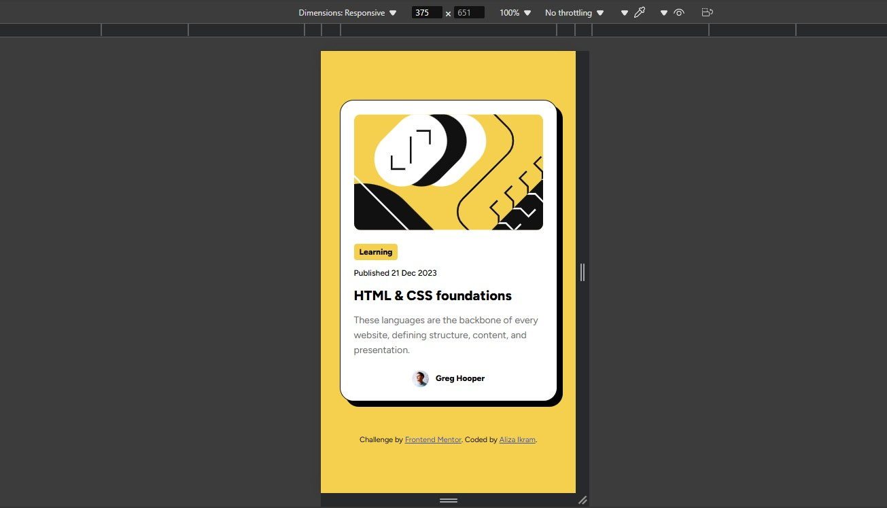

# Frontend Mentor - Blog preview card solution

This is a solution to the [Blog preview card challenge on Frontend Mentor](https://www.frontendmentor.io/challenges/blog-preview-card-ckPaj01IcS). Frontend Mentor challenges help you improve your coding skills by building realistic projects. 

## Table of contents

- [Overview](#overview)
  - [Screenshot](#screenshot)
  - [Links](#links)
- [My process](#my-process)
  - [Built with](#built-with)
  - [What I learned](#what-i-learned)
- [Author](#author)

## Overview

This project is a simple and clean with vibrant theme blog preview card that showcases the essential components of a blog post such as the title, image, description, and a link to the full article. It's designed for use in blogs, portfolio websites, or any project requiring a compact, visually appealing blog preview component.

## Features

- **Responsive Layout**: The card adjusts automatically for various screen sizes, making it suitable for both desktop and mobile devices.
- **Interactive**: Includes hover effects that improve user experience, making it visually engaging.
- **Customizable**: Easily change the card’s color scheme, fonts, and layout styles using simple CSS modifications.
- **Accessible**: Includes accessibility considerations like focus states for keyboard navigation and clear text contrast.

### Screenshot

### Links

- Solution URL: [https://www.frontendmentor.io/solutions/blog-preview-card-Sk_LN9Ocx8]
- Live Site URL: [https://clean-blog-preview-card.netlify.app/]

## My Process 

### Built with

- Semantic HTML5 markup
- CSS custom properties
- Flexbox

### What I learned

- **Responsive Design**:

  I learned how to create a responsive layout using Flexbox and media queries. Flexbox helped me easily align and distribute elements within the card, while media queries allowed me to adjust the layout based on different screen sizes, making the card suitable for both mobile and desktop devices.

- **Hover Effects and Interactivity**:

  I discovered how to implement hover effects using CSS. By changing the color of the title on hover and adding a pointer cursor, I made the card more interactive and visually engaging, giving users clear feedback when they interact with the card.

- **Version Control with Git**:

  Through this project, I practiced using Git for version control. I created commits, pushed changes to GitHub, and set up a GitHub Pages   demo to showcase the final product. This process helped reinforce best practices for managing code in a collaborative environment.

- **Project Deployment**:

  I learned how to deploy a project online using GitHub Pages, making it publicly accessible for others to view and use. This process was a great learning experience for understanding how to share projects with the community.

## Author

- Linkedin - [Aliza Ikram](https://www.linkedin.com/in/aliza-ikram/)
- Frontend Mentor - [@AlizaIkram](https://www.frontendmentor.io/profile/AlizaIkram)
